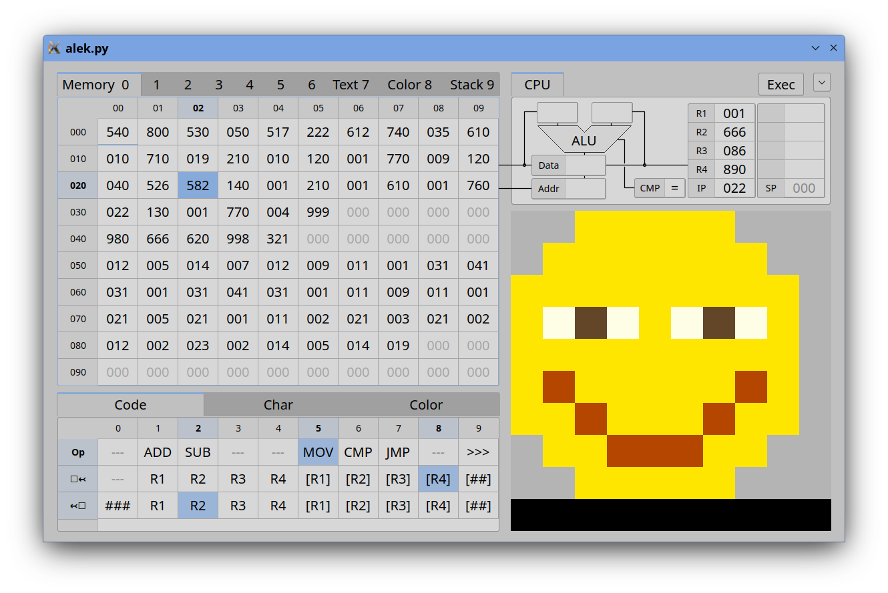

# ALEK
Assembly Learning Environment for Kids

### Purpose
Teach kids elementary concepts of memory and CPU, including:
- instruction codes
- character codes
- RGB color codes
- memory addresses
- ALU and registers
- call stack
- memory-mapped output

# Quick Start
- install Python 3 and PyQt 5
- run "alek.py" with Python
- click the menu arrow in the upper-right corner
- click menu "Demo 1: Hi"
- click the "Exec" button until the processor is halted
- the video output now displays "Hi"
- click menu "Reset" to enable execution again

# Architecture

### Memory
- is organized in 10 pages x 10 rows x 10 cells = 1000 cells
- select page with the Memory tabs

#### Pages
    0..4    code or data
    5..6    (reserved for shared pages)
    7..8    mapped to the video output
    9       stack page

#### Cells
- contain a 3-digit decimal number (0..999, no hex/binary needed)
- each cell has an address, also in range 0..999
- double-click a cell to edit it via keyboard
- click on the Code table entries to enter/edit instructions
- drag-select multiple cells for menu "Clear Memory Cells"

### CPU
- 4 general registers R1..R4
- IP register (Instruction Pointer) has the address of the next instruction
- SP register (Stack Pointer) has the address of last pushed number
- ALU can perform arithmetic operations (+ −) and comparison with numbers
- comparison results "less than (<)", "equal to (=)" , or "greater than (>)"
- data flow is not yet visualized during execution

#### Codes for CPU Instructions
    1ds     ADD     add to destination d the source s
    2ds     SUB     subtract from destination d the source s
    5ds     MOV     move to destination d the source s
    6ds     CMP     compare numbers from sources d and s
    7cs     JMP     jump if condition c is satisfied to cell s
    95d     POP     pop (from stack) to destination d
    96s     PUSH    push (to stack) the source s
    97s     CALL    push IP and jump to cell s
    997     RET     pop to IP (return to caller)
    999     HLT     halt the processor
(See the table in the "Code" tab)

#### Addressing
    0       ###         data immediately after the code (only for source)
    1..4    R1..R4      data in register
    5..8    (R1)..(R4)  data in memory addressed by register
    9       (##)        data in memory with absolute address

#### Condition Codes
    1       <
    2       >
    4       =
    add codes for combinations, e.g. ">=" is 6

#### Code for Characters
    5       space
    6..9    elementary punctation
    10..29  symbols/punctation
    30..39  0..9 digits
    41..66  A..Z letters
    71..96  a..z letters
(See the table in the "Char" tab)
